# Installation

This installation based on [GNS3 Installation](https://docs.gns3.com/docs/getting-started/installation/linux/) for linux.

## Requirement

* Linux (Ubuntu 18.04, Ubuntu 20.04, Debian 9, Debian 10 or other supported linux)
* GNS3
* Docker
* Cisco router image
* Mininet

## Install tools

We prefer to use last long term support (LTS) branch of **Ubuntu** linux.

You can install all needed tools with bellow commands on Ubuntu x64 based linux:

```bash
# echo "deb http://ppa.launchpad.net/gns3/ppa/ubuntu $(lsb_release -cs) main" | sudo tee /etc/apt/sources.list.d/gns3-ubuntu.list
sudo add-apt-repository ppa:gns3/ppa
sudo apt update
sudo apt install gns3-gui gns3-server wireshark

# to install open source edition of docker use "Free"
# else use "CE" to install community edition of docker
DockerType="Free" # "CE"
if [ $DockerType == "Free" ]; then
  sudo apt install docker.io
else
  # reference: https://docs.docker.com/install/linux/docker-ce/ubuntu/#supported-storage-drivers
  sudo apt remove docker docker-engine docker.io
  sudo apt-get install apt-transport-https ca-certificates curl software-properties-common
  curl -fsSL https://download.docker.com/linux/ubuntu/gpg | sudo apt-key add -
  sudo add-apt-repository \
  "deb [arch=amd64] https://download.docker.com/linux/ubuntu $(lsb_release -cs) stable"
  sudo apt update
  sudo apt install docker-ce
fi
sudo usermod -aG ubridge $USER
sudo usermod -aG libvirt $USER
sudo usermod -aG kvm $USER
sudo usermod -aG wireshark $USER
sudo usermod -aG docker $USER
# loading new user group config
sudo su $USER
```

## Get docker images

After install **docker**, you need to get **utnetlab** images and add into `GNS3`.

```bash
docker pull utnetlab/term
docker pull utnetlab/gui
```

Also you can [download](https://github.com/UT-Network-Lab/TCP-IP-Laboratory/releases/latest) and load docker images from archive file as below:

```bash
# archive in (.tar, .tar.gz, .tgz, .bzip, .tar.xz, or .txz) format
docker load -i utnetlab_term.tar.xz
docker load -i utnetlab_gui.tar.xz
```

## Setup GNS3

To load template `Figures` you need to add **Cisco 3725** firmware and **utnetlab** docker images into `GNS3`.
In this section we configure and setup base hosts and router images.

### Docker images

To add Docker images, you need to open `Preferences` menu (under `Edit` in *Linux/Windows* and `GNS3` in *Mac OS*).

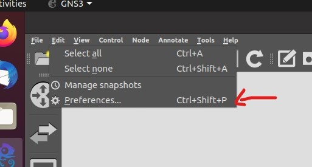

Under `Docker > Docker containers` you can add new images to `GNS3`.

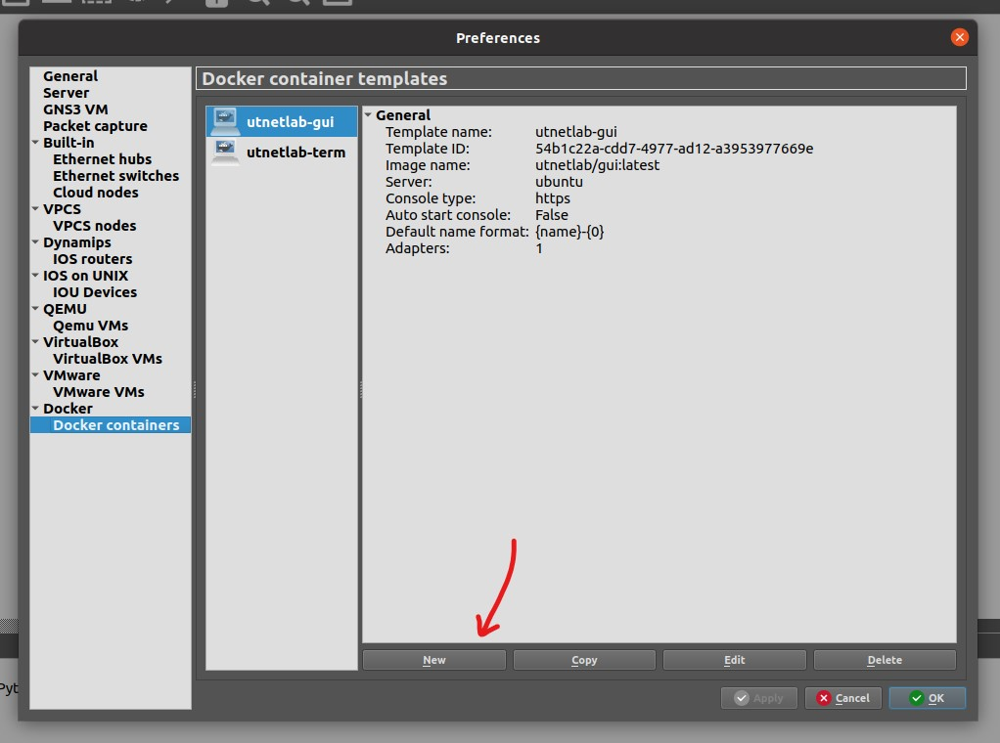

In the `New` dialog, you can select **existing image** (load local images) or **new image** (use docker pull) with image name.

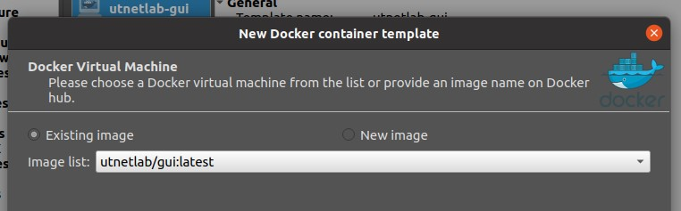

Set image name like `utnetlab-gui`.

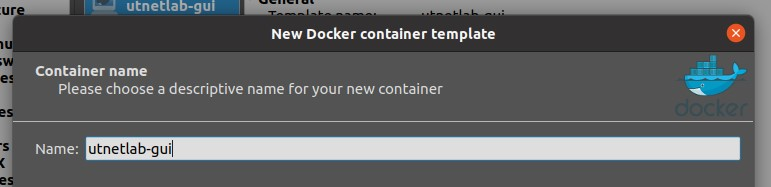

Set adaptor count to `1`.

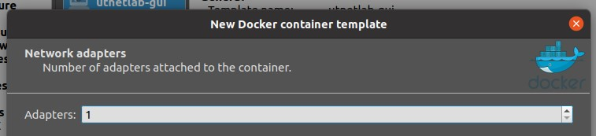

Not need to set start command. But can set for custom start command (like add to start service at docker startup).

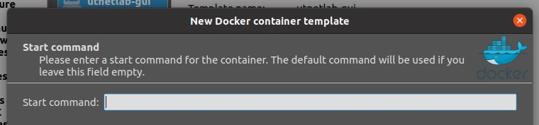

Set console type for your image.

* `telnet` for command line environments
* `vnc` for GUI image output (has a but and random disconnect (need to restart host))
* `http` & `https` for web based service

We made new docker image `utnetlab/gui` to bypass `vnc` bug and see `vnc` output on `http` or `https` port. In this case, after select `https` type, you need edit http port and set to **443**.

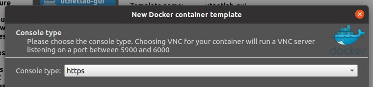

If need custom environments variable for your image, set variables in this page, else left it empty.

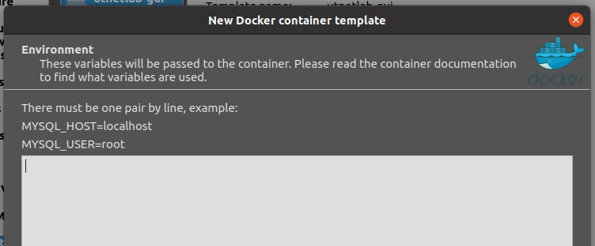

Edit the `utnetlab-gui` item and set **HTTP port in the container** from ~~80~~ into **443**.

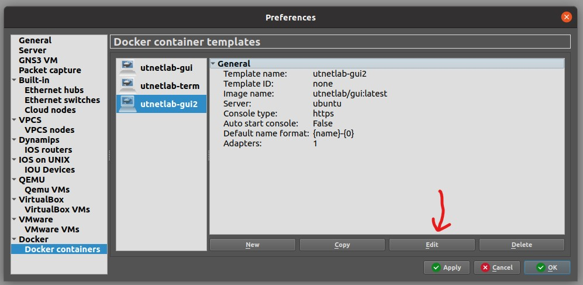
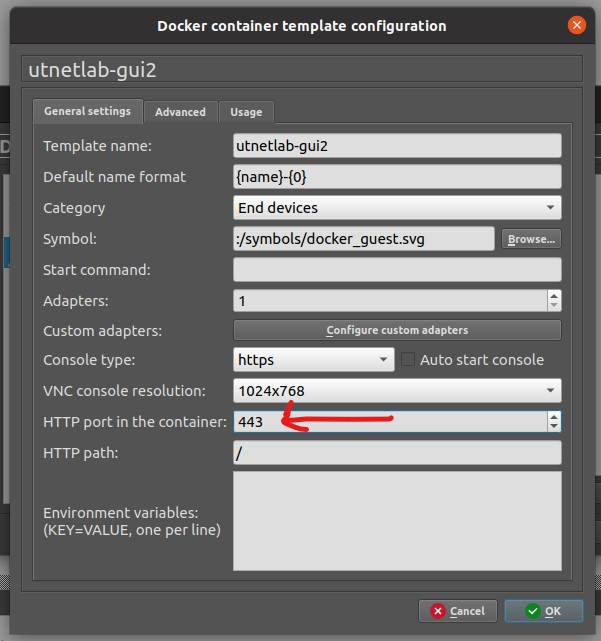

Set configuration as below for two docker (use value according to key at each setup dialog).

GUI:

```js
{
  image: "utnetlab/gui",
  name: "utnetlab-gui",
  adaptor: 1,
  startCommand: null, // or empty
  ConsoleType: "https",
  env: null // or empty
}
```

For terminal image (`utnetlab/term`) select `telnet` for **ConsoleType** and not need to change http port value.

Terminal:

```js
{
  image: "utnetlab/term",
  name: "utnetlab-term",
  adaptor: 1, // number of eth adaptor
  startCommand: null, // or empty
  ConsoleType: "telnet",
  env: null // or empty
}
```


### Cisco images

To load [Cisco images](http://tfr.org/cisco-ios/37xx/3725/c3725-adventerprisek9-mz.124-25d.bin) into `GNS3`, you need got into `Preferences > Dynamips > IOS routers` and add *new images*.

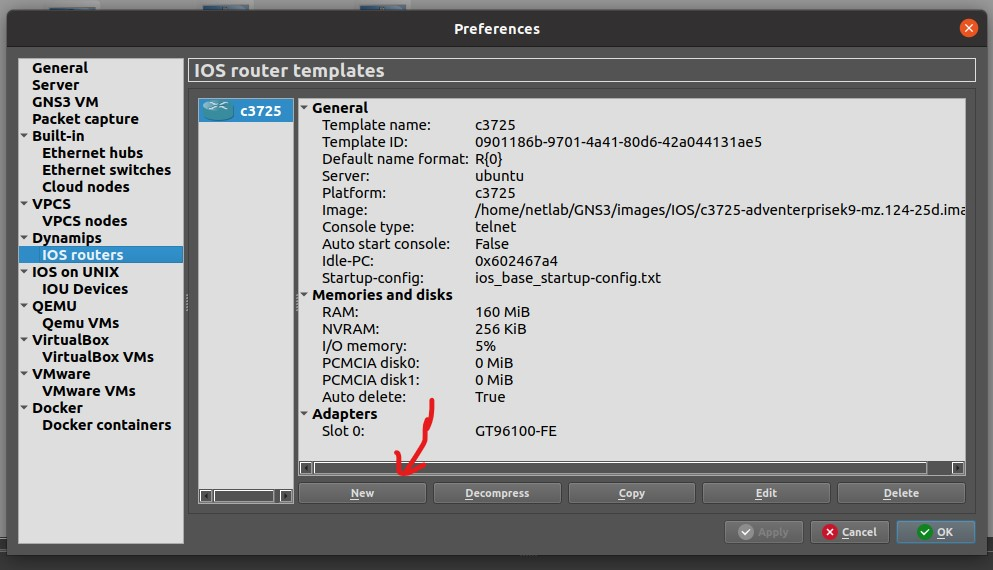

Select file in *Browse* dialog and click on next.

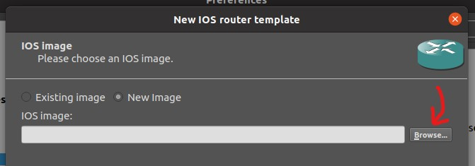

Set name to **c3725** for new router.

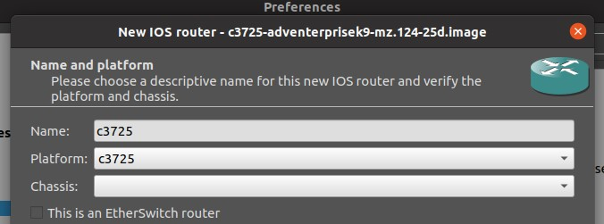

Under *Memory* section, set *Default RAM* to **160 MB** at minimum.

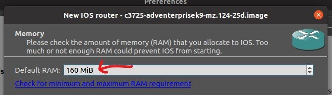

Skip *slots* step until get *Idle-PC* step.

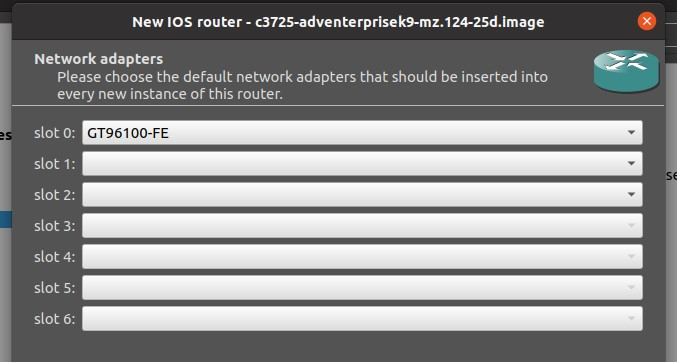
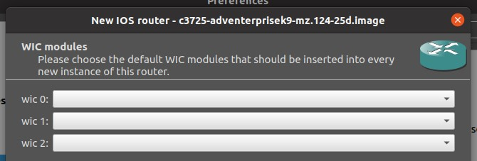

Click on **Idle-PC finder** to find local idle-PC number if it was empty and then press **Finish**.

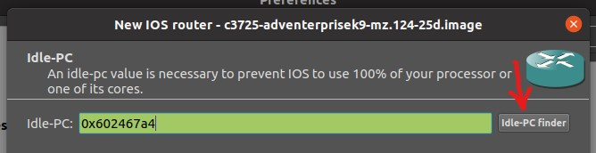
