# GNS3 manual

In this section, we describe all `GNS3` panels and functions.

## Panels

When you open `GNS3` and open or create topology, see something like this image. The list of all panel that you see in `GNS3` written as follows. Commonly used command is **bolded**.

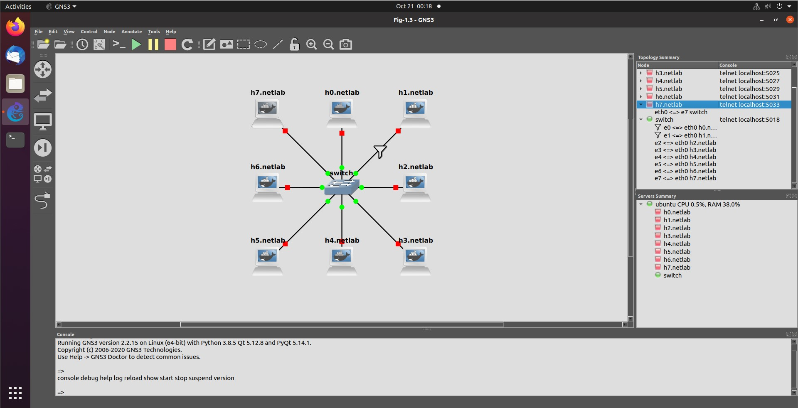

1. Tool bar (1 and 2 for manage project )
    1. **New Project** (*Project Library* in other tab)
    2. Open Project
    ---
    3. Manage snapshot
    4. **Show/Hide Interfaces**
    ---
    5. **Console to all devices**
    7. **Start/Resume all devices**
    8. Suspend all devices
    9. **Stop** all devices
    10. Reload all devices
    ---
    11. Add a note
    12. Insert a picture
    13. Draw rectangle
    14. Draw ellipse
    15. Draw line
    16. Lock/Unlock devices
    17. Zoom in
    18. Zoom out
    19. Take snapshot
2. Network devices
    1. **Browse routers**
    2. **Browse switches**
    3. **Browse end devices**
    4. Browse security devices
    5. **Browse all devices** (show all device in previous category)
    6. **Add link**
3. Topology summery
    * List all devices in Topology (`Node Name` & `Console Connection Command`)
        * Right click: see all node menus (see [Project Devices](#project-devices))
    * In SubItem see all interfaces and link status (capture state, filter state, ...)
        * Right click: see all link menus (see [Link](#link))
4. Server summery
    * List all connected server (with system load)
        * SubItem: List all node in selected server
5. Console
    * Print all `GNS3` log (docker pull, connection failure, command failed or ...)
6. **Topology view**
    * Show all node and device with link (The Topology)
    * **Add device** by dragging device from it's panel (router, switch, host, ...) in to topology
    * **Add link** between devices by click on [link](#link) and click on first device and then second device
    * You can group devices, Add label
    * You can organize topology (move/add/delete/config)

## Projects

The project in `GNS3` is a saved state of topology in disk. You can create, open or load new project. The `GNS3` save all configuration for devices **except** route config (need to enabled in route configuration panel).

### New Project

To create new project, you can click on **`File > New blank project Ctrl+N`** or click on **`New project`** in panel.
You can set project **name** and **location** and then press **`OK`** button.

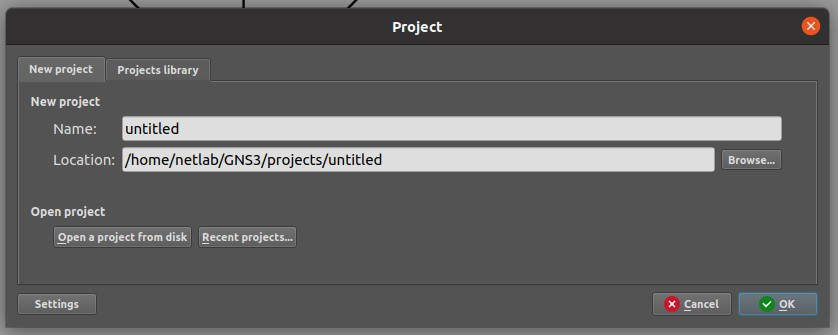

### Open Project

To open `GNS3` project you can click on **`File > Open project Ctrl+O`** or click on **`Open project`** in panel.
Also it available in `Project` panel under `New project` tab.

You can open **recently** project under **`File`** menu and `Project` panel under `New project` tab.

The `Project library` tab in `Project` panel, is the list of all project under default `GNS3` project path (can see or change in `GNS3` preferences).
You can **delete** or duplicate the selected project.

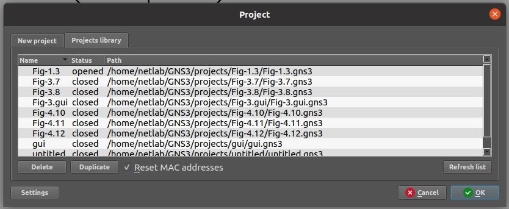

### Save Project

The `GNS3` save all modification on the topology on each change and not need to save the project.
Also `GNS3` have **`File > Save project as`** menu to save the project with different project **name** and **location**.

### Export Project

The `GNS3` have ability to save all project topology and it's resource like device image (docker, router, ...) and share with other.
You can open `Export Project` dialog by selecting **`File > Export portable project`**.
If you don't select `Include base images`, the target `GNS3` must loaded the resource before use topology.

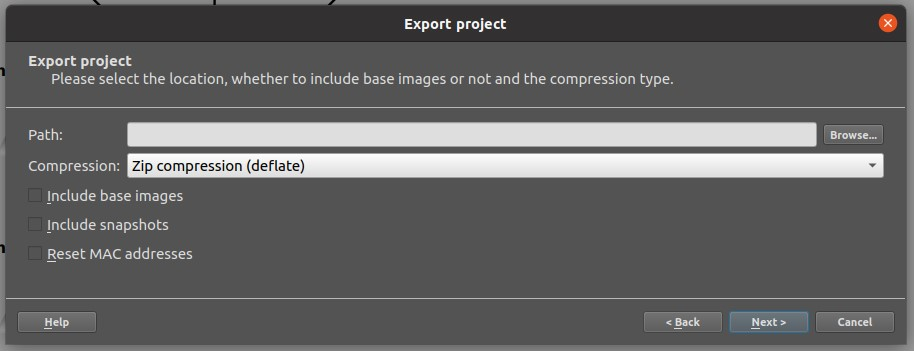

### Import Project

In `GNS3` you can import the exported project with `.gns3p` or `.gns3project`.
You can open `Export Project` dialog by selecting **`File > Import portable project`**.
If the selected portable project don't include the base images, you must load them before start topology.

### Delete Project

In the `Browse Project` dialog, you can delete a project.
Also, after open a project, you can delete it by selecting **`File > Delete Project`**

## Project Devices

The `GNS3` support [host](#hosts), [switches](#switch-or-hub), [router](#router), [security](#security-devices) devices plus [link](#link).
You can add device from `GNS3` template or import manually from `GNS3` `Preferences`.

To add a new device to your project, you can open device panel and **drag** device in to your topology.

### Hosts

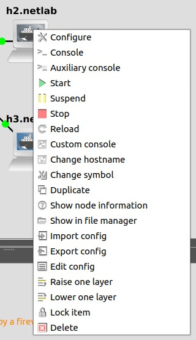

`GNS3` support the following host type that can managed in `GNS3` > `Preferences`.
The docker host is the lightest host in `GNS3`.
You can add custom host in `GNS3` > `Preferences`.

* docker based
* qemu based
* Virtual-box VM based
* VMware VM based

After you add host to your topology, you can **right click** on the new host and see menu.
You can configure the host, Open **console** and **Auxiliary console** (open secondly console in **docker** host), start/stop/suspend/reload host, change symbol, change ip and etc.

> Auxiliary console always run `/bin/sh` command. You can switch to **BASH** environment by run `bash` command

The configure panel of host consist all config that can edited for host.
In the below describe each item:

* `Name`: Host name (has shortcut in host menu)
* `Start command`: custom start command when you start the host (can add new service startup or config change)
* `Adapters`: number of host network adapter
* `Custom adapters`: can edit adaptors name
* `Console type`: can select between  {**Telnet**, **HTTP**, **HTTPS**, **VNC**}
* `VNC console resoloution`:
* `HTTP port in the container`: the port number for **HTTP** and **HTTPS** that map to outer host and use in browser when click on host and select open console.
* `HTTP path`: Default `HTTP` path
* `Environment variables`: the linux **env** value
* `Network configuration`: to edit `/etc/network/interfaces` of the host. Also you can select `Edit config` in host menu (a shortcut to edit network configuration)

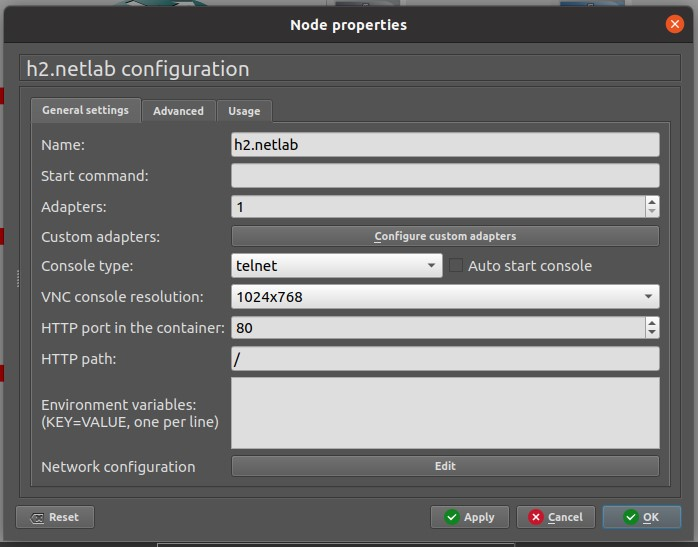

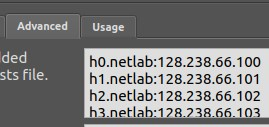

In the `Advanced` tab, you can set `/etc/hosts` file. The syntax of the config is different with the original file.
You can set `host-name:IP` per line to set `hosts` and `IPs` map.
If you set this parameters, you can use the `hostname` instead `IP` in network command.
The `/etc/hosts` file like a local `DNS` server.

### Switch or Hub

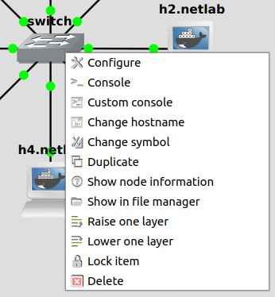

In the config panel of Switch and Hub, you can only change the device name and port number.

### Router

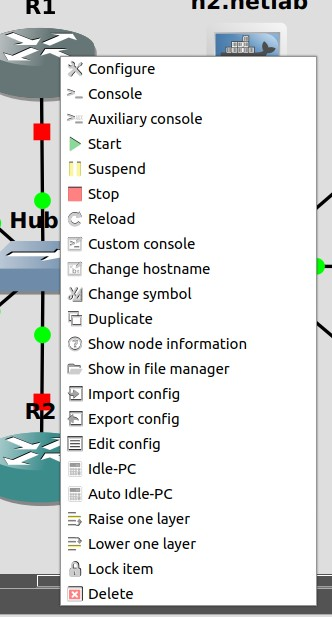

`GNS3` support to emulate Cisco **IOS** image router with `dynamics` program.
In the newer version, `GNS3` support **IOU** image router for simulation.

By default, router start with default configuration file.
In the router console, you can set and apply new configurations.
If you want to save new configs in the router to load in next startup, you need to disable *Automatically delete NVRAM and disk file* in configure panel.

Also you can change the peripheral **slots** and **wic**  in configuration panel.

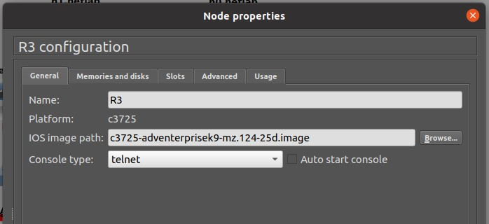

### Security devices

Some vendor or open source project in security, publish it's software in `GNS3` for simulate and debug network such as *Fortinet*.

### link

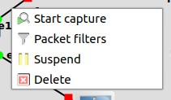

The link has a small control menu.
You can start capture or set some packet filter for each link.

#### Packet Filter

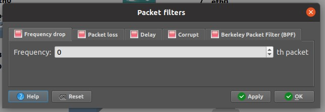

In the packet filter dialog, Yo can set some link property like:

* `Drop`: set the Drop pattern
* `Loss`: set loss rate
* `Delay`: set packet latency and jitter
* `Corrupt`: set corruption chance
* `BPF`: set berkley packet filter

#### Packet Capture

In packet capture dialog, you can select link type and `pcap` file name for capture packet.
By default, the `wireshark` app run after press **OK**, but you can disable it and save captured file.

## GNS3 Web-UI (beta)

You can see beta release of `GNS3` web-ui in this link. You need start **gns3-server** (in local mode of `GNS3` you can run **gns3-gui**. It also run **gns3-server**) before open this link.

* http://localhost:3080/static/web-ui/bundled

## Preferences

You can see `GNS3` preferences manual in [this link](./gns3-setting.md)
